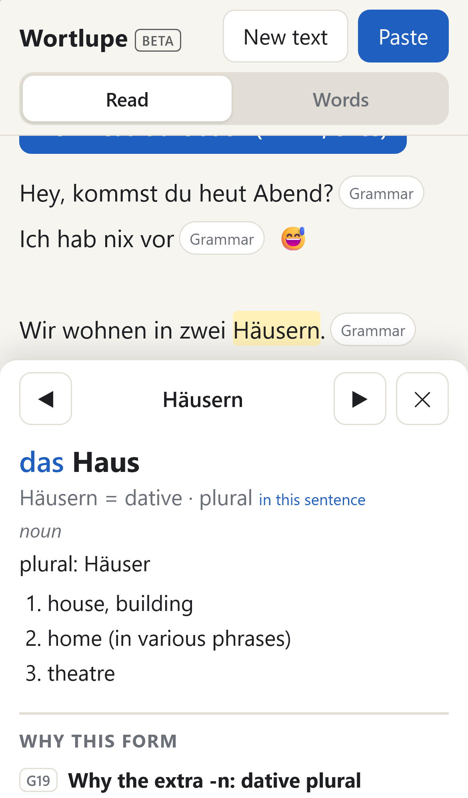
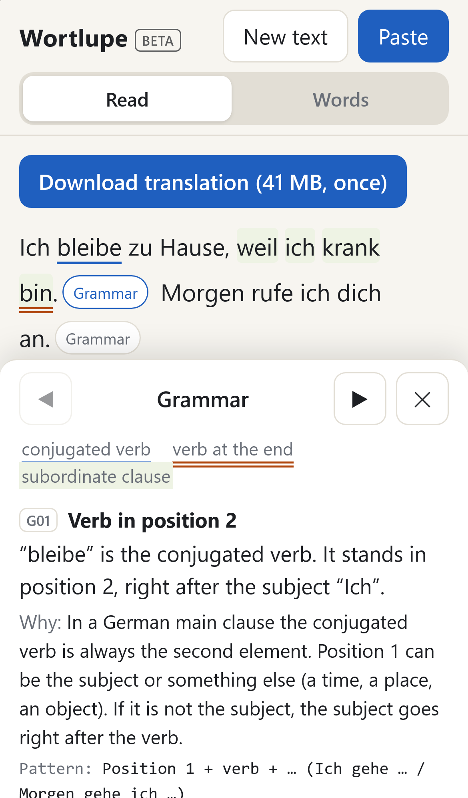
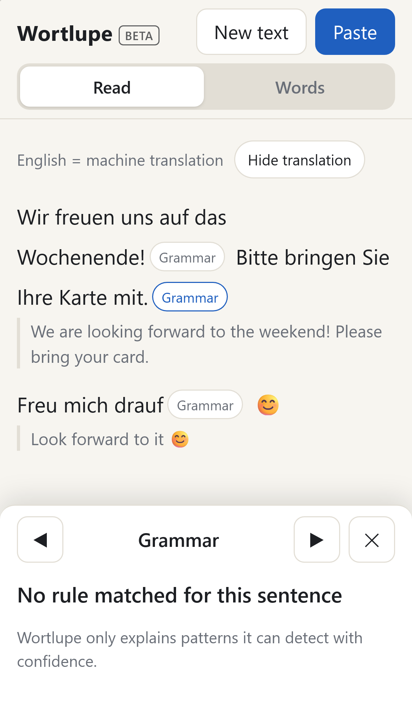

# Wortlupe

**Paste a German message, tap any word, and see *why* it's written that way. It all runs offline on your phone.**

Live (beta): https://wortlupe.iamsherry000.workers.dev · iPhone setup guide: [English](https://wortlupe.iamsherry000.workers.dev/setting-en) / [中文](https://wortlupe.iamsherry000.workers.dev/setting)

<p>
  
  
  
</p>

## Why

The built-in "Look Up" on iOS tells you `Krankenversicherungskarte` means *health insurance card*, and that's all. Wortlupe covers what a plain dictionary skips:

- **Inflected forms back to the base form.** `ging` → `gehen`, `Häusern` → `Haus` (dative plural)
- **Grammar cards.** Article and plural, separable or not, strong or weak, and whether the perfect uses *haben* or *sein*
- **Separable verbs put back together.** The `auf` at the end of the sentence belongs to `stehe` → `aufstehen`
- **Compounds split up.** Kranken + Versicherung + s + Karte
- **Why the sentence looks like this.** A rule engine (not an LLM) spots sentence patterns and word forms and explains them in English as *What → Why → Pattern*

It was inspired by [DianDu](https://github.com/JohnAZoidberg/android-chinese-screenreader), an Android tap-to-read app for Chinese. iOS doesn't let apps read other apps' screens, so Wortlupe is a rebuild, not a port. It's an installable PWA: you copy a WhatsApp message and paste it in, or use an iOS Shortcut from the share sheet.

## How it's built

This project is written **spec first**:

- [`SPEC.md`](SPEC.md) is the product spec: constraints, data, the reader page, the grammar engine, and the zero-fabrication rule
- [`TESTS.md`](TESTS.md) holds the acceptance scenarios in Given/When/Then (Gherkin) style
- `tests/` has the Vitest unit tests and Playwright WebKit end-to-end tests that implement those scenarios

The spec and tests are written in Traditional Chinese. The app UI is in English.

A few design rules that shaped the code:

- **Offline first.** After installing, lookups, grammar and translation make no network requests
- **Zero fabrication.** When the engine isn't sure, it says nothing. A confident wrong answer does more harm to a learner than no answer
- **No runtime dependencies.** npm is only used for building and testing; the shipped app is plain HTML/CSS/JS

### Grammar rules

Each rule is one file in [`src/rules/`](src/rules/). The catalogue is designed to grow:

| | | |
|---|---|---|
| G01 verb second (V2) | G08 preposition + article contraction | G15 article case |
| G02 verb at the end of subordinate clauses | G09 yes/no questions | G16 adjective endings |
| G03 relative clauses | G10 imperative | G17 noun suffix → gender |
| G04 modal + infinitive | G11 negation | G18 verb person endings |
| G05 perfect tense | G12 Konjunktiv II | G19 dative plural -n |
| G06 separable verbs | G13 passive | G20 genitive -s |
| G07 preposition case | G14 zu + infinitive | |

## Project layout

```
index.html, sw.js, manifest.webmanifest   the PWA shell and service worker
src/            app, tokenizer, dictionary lookup, grammar engine, rules, word book
data/           built dictionary (lexicon + 64 runtime shards), hand-written tables
build/          scripts that build data/ from the raw Wiktionary dump
tests/          Vitest unit tests, regression sets, Playwright e2e
mt/             translation model manifest (the model itself is downloaded, see below)
```

## Run it locally

Requires Node 20+.

```sh
npm install
node build/fetch-mt.mjs        # downloads the ~41 MB translation model into mt/ (pinned version + sha256)
npm run serve                  # local server, then open the printed URL
npm test                       # unit tests
npx playwright install webkit
npm run test:e2e               # end-to-end tests (WebKit)
```

The built dictionary in `data/` is committed, so you don't have to rebuild it. To rebuild it anyway, put the [kaikki.org](https://kaikki.org/dictionary/German/) German JSONL dump (`kaikki-de.jsonl`) and the [FrequencyWords](https://github.com/hermitdave/FrequencyWords) German list (`de_full.txt`) into `build/raw/`, then run `node build/extract-slim.mjs` followed by `npm run build:data`.

Deployment is a Cloudflare Workers static-assets site (`npx wrangler deploy`). `.assetsignore` keeps everything except the runtime files out of the upload, and `tests/deploy.test.js` checks that.

## Licenses & credits

- **Code**: [MIT](LICENSE)
- **Dictionary data** (`data/`): adapted from [Wiktionary](https://en.wiktionary.org/) (English edition) as extracted by [kaikki.org](https://kaikki.org/), and from [FrequencyWords](https://github.com/hermitdave/FrequencyWords) (2018, German). Licensed under [CC BY-SA 4.0](https://creativecommons.org/licenses/by-sa/4.0/) (Wiktionary content is also available under GFDL). If you reuse `data/`, keep the same license.
- **Sentence translation** (`mt/`): the [Firefox Translations](https://github.com/mozilla/translations) German→English model and the [Bergamot](https://github.com/browsermt/bergamot-translator) runtime, [MPL-2.0](mt/LICENSE-MPL-2.0.txt).

## Support

If Wortlupe helps you read German, you can [sponsor the project](https://github.com/sponsors/iamsherry000). Thank you!
